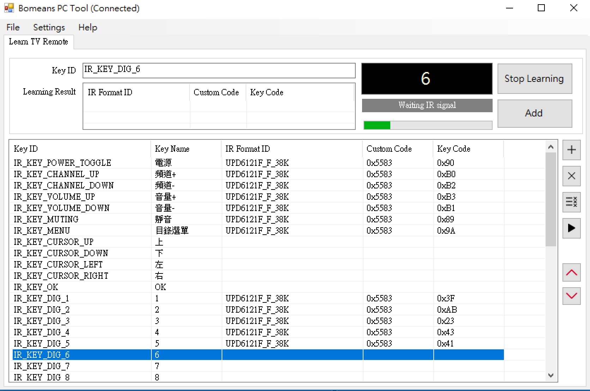

# bomeans_sdk_pc_tool

This application works with Bomeans IrEasy hardware (an USB IR Blaster with learning feature) and build on top of Bomeans.IRNet library.

IrEasy is basically an USB-to-Serial device with a MCU handling IR signal transmission and learning. You can purchase this device from Bomeans Design.

